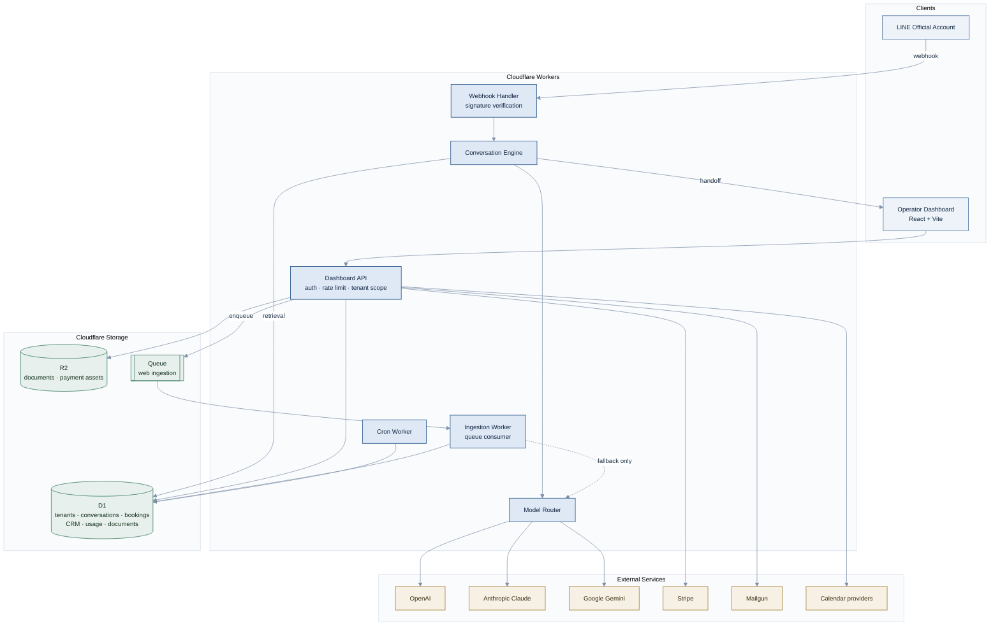

# BotAnswer.ai: Architecture Overview

**An AI receptionist and back-office for businesses that run on LINE.**

BotAnswer handles a customer from first message to completed booking or purchase: answering questions from the business's own documents, taking the booking, collecting and verifying payment, keeping a CRM record, and handing off to a human when the automation should stop.

Multi-tenant SaaS. TypeScript on Cloudflare Workers, D1, R2 and Queues. Currently in private beta.

> Application source is private. This repository documents the architecture, the design decisions behind it, and what the product actually does. Full walkthroughs available on request: [ray@rootsnolimits.com](mailto:ray@rootsnolimits.com).

### See it running

| | |
|---|---|
| **Public demo** | [app.botanswer.ai/demo](https://app.botanswer.ai/demo) &nbsp;·&nbsp; Open, no signup. A limited **Thai-language operator view** only; it does not cover the full dashboard. |
| **Operator dashboard** | [app.botanswer.ai](https://app.botanswer.ai) &nbsp;·&nbsp; The real multi-tenant SPA, currently in private beta. Guided walkthrough available on request. |

**Links:** [botanswer.ai](https://botanswer.ai) | [Roots No Limits](https://rootsnolimits.com) | [LinkedIn](https://linkedin.com/in/raymondkraft)

---

## Why LINE first

LINE is not a niche channel in its home markets. In Thailand, Japan and Taiwan it is where consumers and businesses actually transact. Restaurants take orders in it, clinics book appointments in it, retailers close sales in it. Businesses across essentially every vertical run a LINE Official Account, and most run it by hand.

That makes LINE a concentrated, underserved market rather than one channel among many. BotAnswer is built LINE-first and LINE-native: the Rich Menu editor, the booking flow, and the payment-verification loop are shaped around how LINE OA businesses actually operate, not retrofitted from a generic web-chat widget.

The messaging layer is abstracted behind a platform adapter so additional channels can be added later, but the product is deliberately not channel-agnostic today. Depth in one channel beats shallow coverage of six.

---

## What's implemented

| Area | Detail |
|---|---|
| Conversational AI | Retrieval-augmented answering grounded in tenant business documents |
| Model layer | Multi-model routing across OpenAI, Anthropic Claude and Google Gemini; per-tenant model/platform configuration; structured outputs with schema re-validation |
| Document ingestion | Vision-based extraction of menus, price lists and brochures into retrievable structured JSON; auto-populates in-app menus |
| Web ingestion | Deterministic crawl-and-parse pipeline; LLM called only on parse failure; runs as a Queue consumer |
| LINE integration | Webhook signature verification, endpoint monitoring, native Rich Menu editor publishing via the Messaging API, LINE Login |
| Booking | Native appointment booking and calendar integrations |
| CRM | Customer profiles, locations, business context, conversation continuity |
| Payments | Payment collection and payment-verification workflow |
| Human handoff | Staff handoff with notification, bounded automation |
| Billing | Stripe: 3 plan tiers × 4 currencies (THB / JPY / TWD / USD) × monthly and annual, with AI usage metered per tenant and per model |
| Multilingual | 1,526 message keys across 5 locales (EN, TH, JA, zh-Hans, zh-TW), enforced by an automated audit |
| Security | Per-tenant rate limiting, tenant isolation enforced by cross-tenant tests, SSRF fencing and host allow-listing on all outbound fetches, operator review queue before ingested content reaches customers |

**Planned, not built:** native iOS/Android apps.

---

## Platform topology

<p align="center">
  
</p>

<p align="center"><sub>Two Cloudflare Workers behind one zone, D1 / R2 / Queues for state, and a model router in front of three providers. Native mobile clients are planned, not shipped.</sub></p>

---

## System architecture

The same system as a component graph, for readers who want the edges rather than the inventory:



## Request flow: inbound customer message

```mermaid
%%{init: {'theme':'base','themeVariables':{
  'fontFamily':'ui-sans-serif, -apple-system, Segoe UI, Roboto, sans-serif',
  'fontSize':'13px',
  'primaryColor':'#dfe9f6',
  'primaryTextColor':'#0f2440',
  'primaryBorderColor':'#35608f',
  'lineColor':'#7d90a8',
  'textColor':'#12283f',
  'actorBkg':'#dfe9f6',
  'actorBorder':'#35608f',
  'actorTextColor':'#0f2440',
  'signalColor':'#5f7288',
  'signalTextColor':'#12283f',
  'labelBoxBkg':'#eef3fa',
  'labelBoxBorderColor':'#7f9dc2',
  'labelTextColor':'#12283f',
  'noteBkg':'#f7f0e4',
  'noteBorderColor':'#a8873f',
  'sequenceNumberColor':'#ffffff'
}}}%%
sequenceDiagram
    participant C as Customer (LINE)
    participant W as Webhook Worker
    participant E as Conversation Engine
    participant D as D1
    participant M as Model Router
    participant S as Staff

    C->>W: message event
    W->>W: verify signature, resolve tenant
    W->>E: dispatch
    E->>D: load context (profile, business docs, booking state)
    E->>M: request completion (tenant model config)
    M->>M: select model; fall back on provider error
    M-->>E: structured response (schema re-validated)
    alt handoff condition met
        E->>S: notify staff, pause automation
    else automated
        E->>D: persist turn + metered usage
        E-->>C: reply (booking / payment / answer)
    end
```

---

## Customer journey and knowledge pipeline

What a customer actually experiences, what the runtime does on each inbound message, and how business knowledge gets into the system in the first place:

<p align="center">
  
</p>

<p align="center"><sub>The deterministic branch resolves without a model call. Ingested content stays a proposal until an operator publishes it.</sub></p>

---

## Design decisions

Full ADRs in [`docs/decisions/`](docs/decisions). The two that shaped the system most:

### Deterministic-first ingestion, LLM as fallback

Web ingestion runs a deterministic crawl-and-parse pipeline first and calls a model only when deterministic parsing fails. Sending every page through an LLM is simpler to build and materially worse to operate: it costs per page forever, adds seconds of latency to a path where operators are watching a spinner, and makes output non-reproducible across runs.

The tradeoff is real. The deterministic path needs maintenance as site structures change, and the fallback rate has to be watched. That's an acceptable cost for bounded spend and reproducible results, and the fallback means a parser gap degrades quality rather than breaking ingestion.

The same principle applies to document ingestion, inverted: images genuinely require a vision model, so the model *is* the primary path there, and the discipline moves to constraining output to a strict schema and re-validating it before anything is written.

### Multi-model routing rather than a single provider

Model choice is per-tenant and per-task, not global. Different tasks have different quality floors and different cost ceilings (a greeting is not a document extraction), and provider outages are a real availability risk for a product whose core loop is a model call. Routing with ordered fallback means a provider incident degrades quality instead of taking the product down, and usage is metered per model so cost is attributable rather than a single opaque line item.

---

## Engineering practices

- **1,550+ automated tests** across 168 suites; typecheck gates on every change
- **37 applied D1 migrations**, versioned and applied through Wrangler
- **Automated i18n audit** in the build: 1,526 source keys × 5 locales, failing on any missing or orphaned key
- **Security review** of the ingestion path covering SSRF, host allow-listing and prompt-injection blast radius
- ~168,000 lines of TypeScript, React and SQL across the codebase (excluding lockfiles and generated artifacts)

### On AI-assisted development

This codebase is built with AI-assisted engineering workflows: specs and plans written first, implementation generated and reviewed, then gated behind typecheck, the test suite, the i18n audit, and security review before anything merges or deploys. The architecture decisions, the review, the test strategy, and everything running in production are mine. The tooling changes how fast code gets written; it doesn't change who is accountable for whether it's correct.

---

## Screenshots

<!-- Replace with real files. 4-6 images. Redact tenant names, emails, phone numbers, keys. -->

| | |
|---|---|
| <br/><sub>Native Rich Menu editor: composes and publishes to LINE OA via the Messaging API</sub> | <br/><sub>End-to-end booking inside a LINE conversation</sub> |
| <br/><sub>Vision ingestion: source document beside extracted structured JSON</sub> | <br/><sub>Per-tenant, per-model AI usage metering</sub> |

---

## Stack

TypeScript | Cloudflare Workers, D1, R2, Queues, Rate Limiting, Cron Triggers | React + Vite | Zod | Vitest | Stripe | Mailgun | LINE Messaging API & LINE Login | OpenAI, Anthropic, Google Gemini

---

Built and operated by **Raymond J. Kraft** | [rootsnolimits.com](https://rootsnolimits.com) | [LinkedIn](https://linkedin.com/in/raymondkraft)
