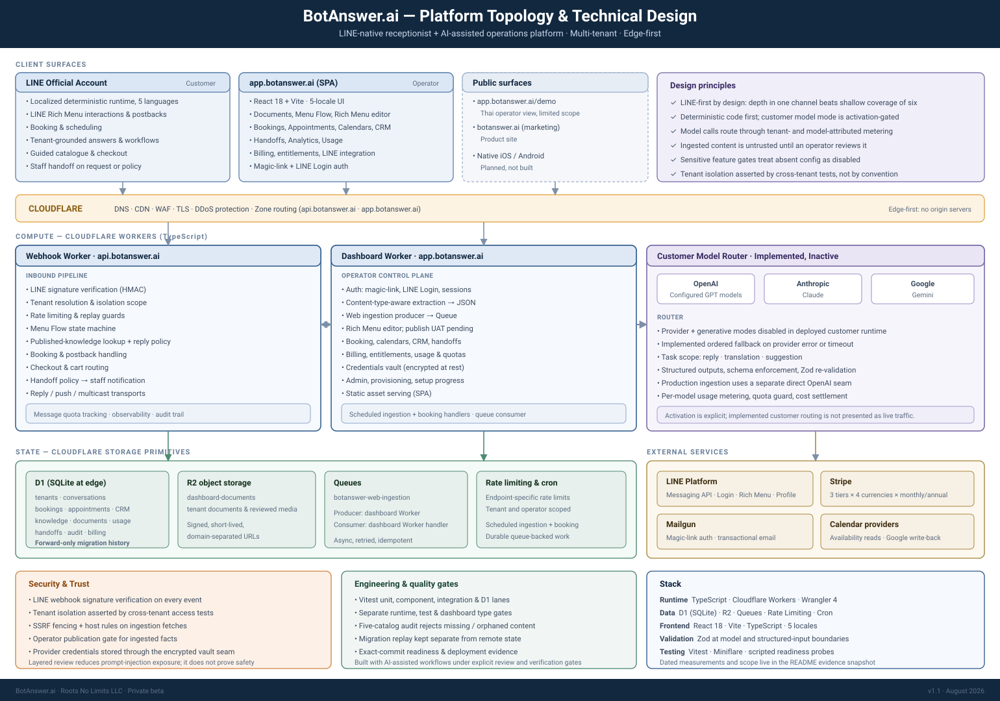
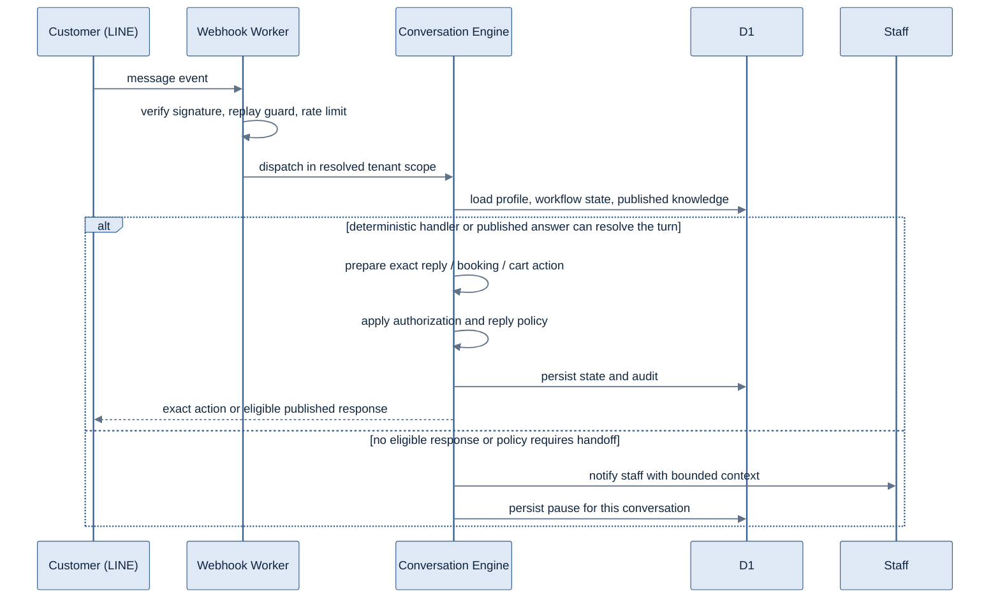
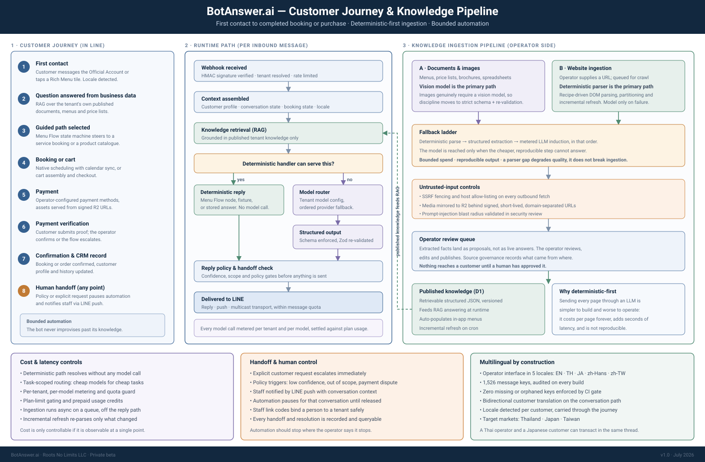
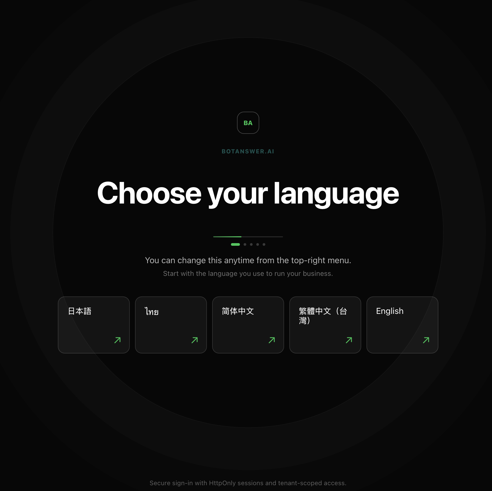

# BotAnswer.ai

<strong>AI platform for LINE-first businesses in Thailand, Japan, and Taiwan</strong>

From first message to grounded answer, booking or order flow, CRM continuity, and
staff handoff, inside the LINE account the business already runs.

**Designed, built, and operated by [Raymond J. Kraft](https://linkedin.com/in/raymondkraft).**

[botanswer.ai](https://botanswer.ai) · [Open the app](https://app.botanswer.ai) · [Static operator screen](https://app.botanswer.ai/demo) · [Guided walkthrough](mailto:ray@rootsnolimits.com?subject=BotAnswer.ai%20architecture%20walkthrough)

> **Private application, public evidence.** The production source is private. This
> repository is the technical case study: system boundaries, architecture diagrams,
> product evidence, design decisions, and a measured engineering snapshot. BotAnswer is
> in open beta with self-serve sign-up.

## Engineering snapshot

<!-- metrics:start -->
| Application source | Automated tests | Test cases | Migrations | Locales |
|---:|---:|---:|---:|---:|
| **269,726** lines | **182,067** lines in 622 files | **4,763** declared | **143** forward-only D1 SQL | **5** catalogs, 4,023 keys |

Measured from the private product repository at commit `8812e30` (2026-09-13); refreshed 2026-09-12. 489,493 lines of code in total across application, tests, migrations, and infrastructure; 722 commits since 2026-07-01, 495 in the last 30 days. Test cases: Vitest, 184 parameterized tables expand at run time. Counting rules and the workflow that keeps this current: <a href="metrics/README.md">metrics/README.md</a>.
<!-- metrics:end -->

A workflow writes these figures. On every push to the product's
`main` branch, [`metrics/collect.mjs`](metrics/collect.mjs) counts the private repository
at that commit and [`metrics/render.mjs`](metrics/render.mjs) rewrites the table above.
The counting rules are public and reproducible: [metrics/README.md](metrics/README.md).
The last full verification gate before a production deploy (2026-09-06, candidate
`ee5a0a4`) ran 3,710 backend and 935 dashboard tests to green, with type checks, build,
locale audit, and readiness probes; see [docs/ENGINEERING_EVIDENCE.md](docs/ENGINEERING_EVIDENCE.md).

**Explore the product:** the subscription-gated web application is at
[app.botanswer.ai](https://app.botanswer.ai) and the public site at
[botanswer.ai](https://botanswer.ai). The no-signup [/demo route](https://app.botanswer.ai/demo)
is a static rendering of one operator screen; the live product is behind sign-up.

**Jump to:** [Product](#the-product-in-four-systems) · [Architecture](#architecture) ·
[Decisions](#architecture-decisions) · [Controls](#trust-failure-and-cost-boundaries) ·
[Evidence](#engineering-evidence) · [Product view](#product-view)

---

## What the system has to decide before it replies

Generating plausible text is the easy part. A production system has to decide whether
the tenant, identity, source, state, tool, budget, and confidence authorize any action
at all.

BotAnswer treats AI as one bounded subsystem inside a business-operations platform:

- grounded business answers draw only from the current tenant's **published** knowledge;
- deterministic state machines own bookings, carts, postbacks, and other exact flows;
- structured model output used by application code crosses a schema-validation boundary;
- ingestion produces proposals that stay unpublished until an operator approves them;
- customer model calls are activation-gated per tenant and carry tenant/model attribution and plan checks; and
- policy or an explicit customer request pauses automation and hands control to staff.

That is the architectural story in this repository: a system that knows where
automation is allowed to act and where it must stop.

## The product in four systems

| System | What is deployed in the open beta |
|---|---|
| **Customer runtime** | Deterministic LINE and published-knowledge flows; Super Menu journeys built in Visual Menu Studio; booking and cart/checkout paths; bounded staff handoff |
| **Operator control plane** | Five-locale React dashboard; document and website intake; fact review and publication; LINE Rich Menu editor and composer; bookings, calendars, CRM, staff targets, usage, billing, and workspace administration |
| **Knowledge and AI plane** | Operator-side extraction by content type; deterministic-first website ingestion with a separate OpenAI fallback seam; source provenance; three answer modes per tenant (static Q&A, curated answers approved and cached by the operator, and configurable live AI); a customer router across OpenAI, Anthropic, and Google with ordered fallback; structured output re-validation |
| **Commercial and platform plane** | Multi-tenant Cloudflare Workers/D1/R2/Queues architecture; Stripe plans in THB, JPY, TWD, and USD; per-tenant, per-model metering; tenant-scoped rate limits and readiness controls |

**Deliberate boundaries:** native iOS and Android clients are on the roadmap and have not been built.
Live AI is an activation-gated mode that each tenant turns on; static Q&A and curated
answers are the defaults. Automated bank settlement verification is not claimed.

## Why LINE first

In BotAnswer's target markets, Thailand, Japan, and Taiwan, LINE is often both the
customer conversation and the operating surface around it. A generic adapter can send
messages; it cannot make Rich Menus, postbacks, LINE Login, quota behavior, and staff
handoff feel native without designing for them.

The messaging seam stays abstracted so another channel can be added deliberately, and
the product does not pretend to be channel-agnostic today. Depth in one operating
environment is the choice. The trade-off is written down in
[ADR 0004](docs/decisions/0004-line-first-not-channel-agnostic.md).

---

## Architecture

  

Two Cloudflare Worker deployables: a customer-facing webhook runtime and an operator control plane. Queue consumption and scheduled work are handlers within the control-plane Worker; there are no additional deployed services.

The architecture is edge-first on purpose: the request path, dashboard API, state,
private objects, and asynchronous ingestion all stay on Cloudflare primitives. Model,
billing, email, LINE, and calendar providers sit behind narrow adapters; none becomes
the system of record for tenant workflow state.

### Inbound message lifecycle

The deterministic branch resolves without a model call. Live AI answers go through the
model router described in [ADR 0002](docs/decisions/0002-multi-model-routing.md) behind
the tenant's activation boundary; production website ingestion uses a separate direct
OpenAI fallback seam.

### Customer journey and knowledge pipeline

  

The deterministic branch resolves without a model call. Extracted content remains a proposal until an operator publishes it; only published tenant knowledge is eligible for retrieval.

### The marketing site is captured from the product

The screenshots on [botanswer.ai](https://botanswer.ai) are captured from the built
operator dashboard by a Playwright harness, once per interface language, and written
straight into the site's image slots at build time. The product videos are recordings
of the same surfaces, with narration and captions generated per language. A slot with
no capture route renders as an empty frame on the site, so the site cannot show a
screen the product does not have and cannot drift from what is deployed. The same rule
applies to the numbers at the top of this page.

---

## Architecture decisions

Each ADR records the rejected alternative, the operational consequence, and the
condition that would justify revisiting the choice, alongside the decision itself.

| Decision | Why it exists | Accepted trade-off |
|---|---|---|
| [Deterministic-first web ingestion](docs/decisions/0001-deterministic-first-ingestion.md) | Avoid paying model cost on pages a reproducible parser can handle | Recipes require maintenance; real coverage still needs instrumentation |
| [Multi-provider model routing](docs/decisions/0002-multi-model-routing.md) | Reduce dependence on one provider and match model cost and quality to the task | More adapters and provider differences to test |
| [Operator-gated knowledge publication](docs/decisions/0003-operator-review-queue.md) | Keep unreviewed extraction out of customer retrieval | Adds onboarding friction and a review workload |
| [LINE-first, not channel-agnostic](docs/decisions/0004-line-first-not-channel-agnostic.md) | Use the native surfaces that matter in the chosen market | A second channel is real product and engineering work |
| [Per-tenant, per-model usage metering](docs/decisions/0005-metered-ai-usage-and-plan-gating.md) | Make variable AI cost attributable before enforcing plan limits | Every call site must stay inside the metered seam |

[Read the ADR index →](docs/decisions/README.md)

## Trust, failure, and cost boundaries

| Boundary | Enforcement | Failure behavior |
|---|---|---|
| **Tenant data** | Tenant identity is resolved before repository access; cross-tenant cases are explicit tests | Deny; never fall back to a broader scope |
| **Published knowledge** | Proposed and published states are separate; only published facts enter retrieval | Missing publication state means unavailable; nothing becomes live by default |
| **Ingestion network** | URL validation, SSRF fencing, and host rules cover website and media ingestion fetches | Reject or quarantine the source; never follow it into private address space |
| **Model output** | Provider adapters normalize errors; structured output is schema-enforced and re-validated | Try an eligible configured fallback, then fail closed or hand off |
| **Human authority** | Handoff policy and explicit customer requests pause automation for the conversation | Staff receives bounded context and owns the next action |
| **AI spend** | The activation-gated customer router meters per tenant and model and checks quota before provider work | Stop before unentitled spend; no after-the-fact accounting |
| **Release state** | Verification lanes stay distinct and deployment requires evidence for the exact commit | A timeout, focused pass, or old receipt cannot be promoted into release proof |

## Engineering evidence

- **Two TypeScript compile gates** cover the Worker/runtime and test projects; the
  dashboard has its own typecheck and production build.
- **Vitest in three projects:** a Worker/runtime unit project, a D1 project that runs
  each file against a private Miniflare instance seeded from one migrated snapshot, and
  the dashboard SPA project under jsdom.
- **Five-catalog localization audit** rejects missing and orphaned entries and is a
  release-blocking check; the current catalogs pass with zero of either.
- **Forward-only D1 history** is rehearsed on disposable data before any remote
  application; production is confirmed through the migration named in the deploy
  receipt.
- **Evidence lanes stay separate:** unit/component, D1/Miniflare, browser, provider,
  production, commit, and deployment observations are reported for what they prove.
- **Exact-commit release discipline:** a deployment candidate must match its successful
  verification receipt; dirty, diverged, or changed candidates are rejected.

[Read the measurement method, the last full gate, and the non-claims →](docs/ENGINEERING_EVIDENCE.md)

### AI-assisted engineering, accountable ownership

AI is an implementation accelerator inside a spec-first, verification-gated workflow.
I own the domain model, architecture, code review, test design, release decisions, and
production operations. Generated changes enter the deployed product only after they
satisfy the same scoped evidence gates as any other change.

---

## Product view

The subscription-gated web application is at [app.botanswer.ai](https://app.botanswer.ai);
the public site with per-language captures is at [botanswer.ai](https://botanswer.ai).
The no-signup [/demo route](https://app.botanswer.ai/demo) is a static sample of one
operator screen. The onboarding capture below documents one product principle: the
operator's language is the first setup decision, ahead of everything else.

  

Onboarding capture. The operator dashboard supports English, Thai, Japanese, Simplified Chinese, and Traditional Chinese.

---

## Stack

TypeScript · Cloudflare Workers · D1 · R2 · Queues · Rate Limiting · Cron Triggers ·
React · Vite · Zod · Vitest · Playwright (capture harness) · Stripe · Mailgun · LINE Messaging API · LINE Login ·
OpenAI · Anthropic · Google Gemini

---

Built and operated by **Raymond J. Kraft** · [Roots No Limits](https://rootsnolimits.com) ·
[LinkedIn](https://linkedin.com/in/raymondkraft) · [ray@rootsnolimits.com](mailto:ray@rootsnolimits.com)

