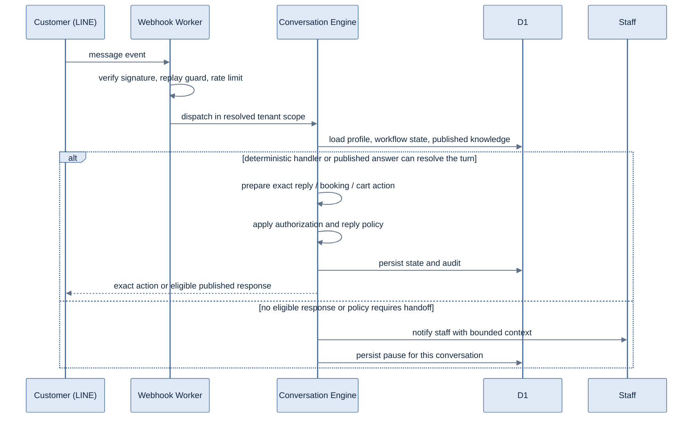

# BotAnswer.ai

<strong>A LINE-native receptionist and AI-assisted operations platform for multilingual businesses</strong>

From first message to grounded answer, booking or order flow, CRM continuity, and
human handoff.

**Designed, built, and operated by [Raymond J. Kraft](https://linkedin.com/in/raymondkraft).**

[Public demo](https://app.botanswer.ai/demo) · [Product site](https://botanswer.ai) · [Guided walkthrough](mailto:ray@rootsnolimits.com?subject=BotAnswer.ai%20architecture%20walkthrough)

> **Private application, public evidence.** The production source remains private. This
> repository is the technical case study: system boundaries, architecture diagrams,
> product evidence, design decisions, and a dated engineering snapshot. BotAnswer is
> currently a deployed private beta.

## Engineering snapshot

<table>
  <tr>
    <td align="center"><strong>≈2,700</strong> automated test cases captured WIP inventory</td>
    <td align="center"><strong>203,782</strong> authored TS/TSX/SQL lines captured WIP inventory</td>
    <td align="center"><strong>0068</strong> production schema read-only checkpoint</td>
    <td align="center"><strong>2,099 each × 5</strong> locale catalogs last complete audit</td>
  </tr>
</table>

<strong>Captured 24 August 2026.</strong> Working-tree inventory, last-green verification, and production state are intentionally separate. <a href="docs/ENGINEERING_EVIDENCE.md">Definitions, receipts, and measurement method →</a>

**See it running:** the [no-signup public demo](https://app.botanswer.ai/demo) is a
limited Thai-language operator view. The full multi-tenant dashboard is in private
beta at [app.botanswer.ai](https://app.botanswer.ai); a guided technical and product
walkthrough is available on request.

**Jump to:** [Product](#the-product-in-four-systems) · [Architecture](#architecture) ·
[Decisions](#architecture-decisions) · [Controls](#trust-failure-and-cost-boundaries) ·
[Evidence](#engineering-evidence) · [Product view](#product-view)

---

## The hard part is not generating a reply

Generating plausible text is easy. A production system has to decide whether the
tenant, identity, source, state, tool, budget, and confidence authorize any action at
all.

BotAnswer treats AI as one bounded subsystem inside a business-operations platform:

- grounded business answers draw only from the current tenant's **published** knowledge;
- deterministic state machines own bookings, carts, postbacks, and other exact flows;
- structured model output used by application code crosses a schema-validation boundary;
- ingestion produces proposals, never silently published facts;
- activation-gated customer model calls carry tenant/model attribution and plan checks; and
- policy or an explicit customer request pauses automation and hands control to staff.

That is the architectural story in this repository: not “a chatbot,” but a system that
knows where automation is allowed to act—and where it must stop.

## The product in four systems

| System | What is deployed in the private beta |
|---|---|
| **Customer runtime** | Deterministic LINE and published-knowledge flows; Menu Flow journeys; booking and cart/checkout paths; bounded staff handoff |
| **Operator control plane** | Five-locale React dashboard; document and website intake; fact review and publication; LINE Rich Menu editor/composer; bookings, calendars, CRM, staff targets, usage, billing, and workspace administration |
| **Knowledge and AI plane** | Operator-side extraction by content type; deterministic-first website ingestion with a separate OpenAI fallback seam; source provenance; an implemented but inactive customer router for OpenAI, Anthropic, and Google; structured output re-validation |
| **Commercial and platform plane** | Multi-tenant Cloudflare Workers/D1/R2/Queues architecture; Stripe plans in THB, JPY, TWD, and USD; per-tenant/per-model metering; tenant-scoped rate limits and readiness controls |

**Deliberate boundaries:** native iOS and Android clients are planned, not built.
Customer provider and generative modes are disabled in the deployed beta; the
three-provider customer router is implemented but inactive. Payment-proof intelligence
and the repaired Rich Menu publication path are locally implemented; production
deployment and live UAT remain pending. Automated bank settlement verification is not
claimed.

## Why LINE first

In BotAnswer's target markets—Thailand, Japan, and Taiwan—LINE is often both the
customer conversation and the operating surface around it. A generic adapter can send
messages; it cannot make Rich Menus, postbacks, LINE Login, quota behavior, and staff
handoff feel native without designing for them.

The messaging seam remains abstracted so another channel can be added deliberately,
but the product does not pretend to be channel-agnostic today. Depth in one operating
environment is the choice. The trade-off is explicit in
[ADR 0004](docs/decisions/0004-line-first-not-channel-agnostic.md).

---

## Architecture

  

Two Cloudflare Worker deployables: a customer-facing webhook runtime and an operator control plane. Queue consumption and scheduled work are handlers within the control-plane Worker, not additional deployed services.

The architecture is intentionally edge-first: the request path, dashboard API, state,
private objects, and asynchronous ingestion all remain on Cloudflare primitives. Model,
billing, email, LINE, and calendar providers sit behind narrow adapters; none becomes
the system of record for tenant workflow state.

### Inbound message lifecycle

The deployed webhook runtime keeps customer provider and generative modes disabled.
The model router described in [ADR 0002](docs/decisions/0002-multi-model-routing.md) is
implemented behind that activation boundary; production website ingestion uses a
separate direct OpenAI fallback seam.

### Customer journey and knowledge pipeline

  

The deterministic branch resolves without a model call. Extracted content remains a proposal until an operator publishes it; only published tenant knowledge is eligible for retrieval.

---

## Architecture decisions

The ADRs include the rejected alternative, the operational consequence, and the
condition that would justify revisiting the choice—not just the winning design.

| Decision | Why it exists | Accepted trade-off |
|---|---|---|
| [Deterministic-first web ingestion](docs/decisions/0001-deterministic-first-ingestion.md) | Avoid paying model cost on pages a reproducible parser can handle | Recipes require maintenance; real coverage still needs instrumentation |
| [Multi-provider model routing](docs/decisions/0002-multi-model-routing.md) | Reduce dependence on one provider and match model cost/quality to the task | More adapters and provider differences to test |
| [Operator-gated knowledge publication](docs/decisions/0003-operator-review-queue.md) | Keep unreviewed extraction out of customer retrieval | Adds onboarding friction and a review workload |
| [LINE-first, not channel-agnostic](docs/decisions/0004-line-first-not-channel-agnostic.md) | Use the native surfaces that matter in the chosen market | A second channel is real product and engineering work |
| [Per-tenant, per-model usage metering](docs/decisions/0005-metered-ai-usage-and-plan-gating.md) | Make variable AI cost attributable before enforcing plan limits | Every call site must stay inside the metered seam |

[Read the ADR index →](docs/decisions/README.md)

## Trust, failure, and cost boundaries

| Boundary | Enforcement | Failure behavior |
|---|---|---|
| **Tenant data** | Tenant identity is resolved before repository access; cross-tenant cases are explicit tests | Deny rather than fall back to a broader scope |
| **Published knowledge** | Proposed and published states are separate; only published facts enter retrieval | Missing publication state means unavailable, never implicitly live |
| **Ingestion network** | URL validation, SSRF fencing, and host rules cover website and media ingestion fetches | Reject or quarantine the source; never follow it into private address space |
| **Model output** | Provider adapters normalize errors; structured output is schema-enforced and re-validated | Try an eligible configured fallback, then fail closed or hand off |
| **Human authority** | Handoff policy and explicit customer requests pause automation for the conversation | Staff receives bounded context and owns the next action |
| **AI spend** | The activation-gated customer router meters per tenant/model and checks quota before provider work | Stop before unentitled spend rather than accounting for it afterward |
| **Release state** | Verification lanes stay distinct and deployment requires evidence for the exact commit | A timeout, focused pass, or old receipt cannot be promoted into release proof |

## Engineering evidence

- **Approximately 2,700 test cases across 280 Git-visible test files.** The captured
  working-tree inventory was 2,684. This is an inventory,
  not a claim that an uncommitted working tree received a fresh full-suite pass.
- **Two TypeScript compile gates** cover the Worker/runtime and test projects; the
  dashboard has its own typecheck and production build.
- **Five-catalog localization audit** rejects missing and orphaned entries. The last
  recorded complete gate audited 2,099 keys in each catalog.
- **Forward-only D1 history** is rehearsed separately from remote application state.
  The captured snapshot contained 73 sequentially numbered migration files; production
  was independently confirmed through migration 0068.
- **Evidence lanes remain separate:** unit/component, D1/Miniflare, browser, provider,
  production, commit, and deployment observations are reported for what they prove.
- **Exact-commit release discipline:** a deployment candidate must match its successful
  verification receipt; dirty, diverged, or changed candidates are rejected.

[Read the measurement method, last complete checkpoints, and non-claims →](docs/ENGINEERING_EVIDENCE.md)

### AI-assisted engineering, accountable ownership

AI is an implementation accelerator inside a spec-first, verification-gated workflow.
I own the domain model, architecture, code review, test design, release decisions, and
production operations. Generated changes do not enter the deployed private beta on the
strength of generation alone; they must satisfy the same scoped evidence gates.

---

## Product view

For live behavior, use the limited, no-signup [public demo](https://app.botanswer.ai/demo).
The private-beta onboarding capture below documents a separate product principle: the
operator's language is the first setup decision, not a preference buried after setup.

  

Private-beta onboarding capture, not the limited public-demo route. The operator dashboard supports English, Thai, Japanese, Simplified Chinese, and Traditional Chinese.

---

## Stack

TypeScript · Cloudflare Workers · D1 · R2 · Queues · Rate Limiting · Cron Triggers ·
React · Vite · Zod · Vitest · Stripe · Mailgun · LINE Messaging API · LINE Login ·
OpenAI · Anthropic · Google Gemini

---

Built and operated by **Raymond J. Kraft** · [Roots No Limits](https://rootsnolimits.com) ·
[LinkedIn](https://linkedin.com/in/raymondkraft) · [ray@rootsnolimits.com](mailto:ray@rootsnolimits.com)

